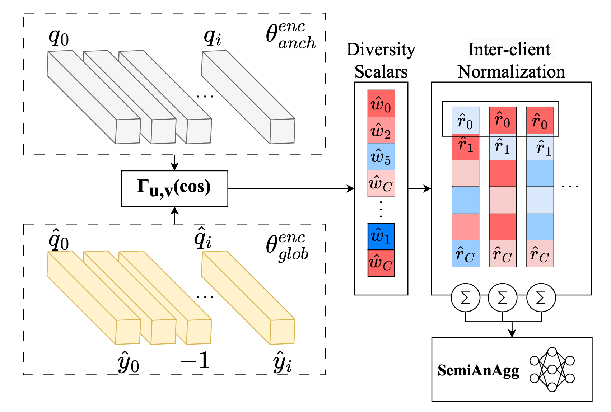

# [Semi-supervised Anchor-Based Federated Aggregation](https://openreview.net/forum?id=GDn6z9LIDs)
###### [Marawan Elbatel](https://marwankefah.github.io/), Hualiang Wang, Jixiang Chen, Hao Wang, and [Xiaomeng Li](https://xmengli.github.io/)

Official implementation of the TMLR-accepted paper: _Learning Unlabeled Clients Divergence for Federated Semi-Supervised Learning via Anchor Model Aggregation_

## Abstract

Federated semi-supervised learning (FedSemi) refers to scenarios where there may be clients with fully labeled data, clients with partially labeled, and even fully unlabeled clients while preserving data privacy. However, challenges arise from client drift due to undefined heterogeneous class distributions and erroneous pseudo-labels. Existing FedSemi methods typically fail to aggregate models from unlabeled clients due to their inherent unreliability, thus overlooking unique information from their heterogeneous data distribution, leading to sub-optimal results. In this paper, we enable unlabeled client aggregation through SemiAnAgg, a novel Semi-supervised Anchor-Based federated Aggregation. SemiAnAgg learns unlabeled client contributions via an anchor model, effectively harnessing their informative value. Our key idea is that by feeding local client data to the same global model and the same consistently initialized anchor model (i.e., random model), we can measure the importance of each unlabeled client accordingly. Extensive experiments demonstrate that SemiAnAgg achieves new state-of-the-art results on four widely used FedSemi benchmarks, leading to substantial performance improvements: a 9% increase in accuracy on CIFAR-100 and a 7.6% improvement in recall on the medical dataset ISIC-18, compared with prior state-of-the-art.
<p align="center">
  
</p>


---

## Main Results


| Labeling Strategy | Method               | SVHN | CIFAR-100 | CIFAR-100-LT | ISIC-18 |
|------------------|----------------------|------|-----------|--------------|---------|
| Fully supervised | FedAvg (upper-bound) | 94.77 | 64.75 | 38.40 | 80.78 |
|                  | FedAvg (lower-bound) | 75.86 | 29.51 | 14.38 | 66.25 |
|                  | [RSCFed](https://github.com/xmed-lab/RSCFed)           | 81.84 | 31.98 | 15.13 | 69.85 |
|       Semi supervised           | [IsoFed]()           | 82.48 | 32.49 | 16.98 | 68.49 |
|                  | [CBAFed](https://github.com/minglllli/CBAFed)           | 91.57 | 40.20 | 14.29 | 69.99 |
|  | **SemiAnAgg (ours)** | **91.69** | **49.23** | **23.81** | **72.24** |


---


## Preparation
1. Create conda environment:
 
		conda create -n SemiAnAgg python=3.8
		conda activate SemiAnAgg

2. Install dependencies: install [pytorch](https://pytorch.org/get-started/locally/)

	     pip install -r requirements.txt	

		

3.  Download Warm-up Models (gdown)

		pip install gdown
		gdown --id 1Td7SyxO7lRP-K7Z4-n88Drj9r5FUhFZH --output warmup.zip
		unzip warmup.zip


# Training
To reproduce the results, please modify the path of warm-up model accordingly. Warm-up models are trained on labeled clients. For different datasets, please modify file path, arguments "dataset" and "model" correspondingly.


### SVHN Dataset:

```
python generate_rand_embedding.py --dataset SVHN --model Res18_cifar --gpu 0 --opt sgd --base_lr 0.03 
python train.py --rounds 500 --local_ep 1 --num_labeled 1 --unsup_num=9 --dataset SVHN --model Res18_cifar --gpu 0 --opt sgd --base_lr 0.03 --loss_fn_name BSM
```


### ISIC 2018 dataset:
Download from Kaggle:
```
kaggle datasets download -d kmader/skin-cancer-mnist-ham10000
```
Organize the data:
```
unzip skin-cancer-mnist-ham10000 -d data/med_classify_dataset
mkdir data/ham
mv  -v data/med_classify_dataset/HAM10000_images_part_1/* data/ham
mv  -v data/med_classify_dataset/HAM10000_images_part_2/* data/ham
```
Generate random embeddings and train:
```
python generate_rand_embedding.py --dataset skin --model Res18 --gpu 0 --opt sgd --base_lr 0.03 --pre_sz=250 --input_sz=224 --datadir ./data/ham/
python train.py --rounds 500 --local_ep 1 --num_labeled 1 --unsup_num=9 --dataset skin --model Res18 --gpu 0 --opt sgd --base_lr 0.03 --loss_fn_name BSM --pre_sz=250 --input_sz=224 --datadir ./data/ham/
```


### Acknoweldgement
	
We would like to acknoweldge RSCFed and CBAFed as we built our code on their base.


## Citation
````
@article{
elbatel2024learning,
title={Learning Unlabeled Clients Divergence for Federated Semi-Supervised Learning via Anchor Model Aggregation},
author={Marawan Elbatel and Hualiang Wang and Jixiang CHEN and Hao Wang and Xiaomeng Li},
journal={Transactions on Machine Learning Research},
issn={2835-8856},
year={2024},
url={https://openreview.net/forum?id=GDn6z9LIDs},
note={}
}
````

